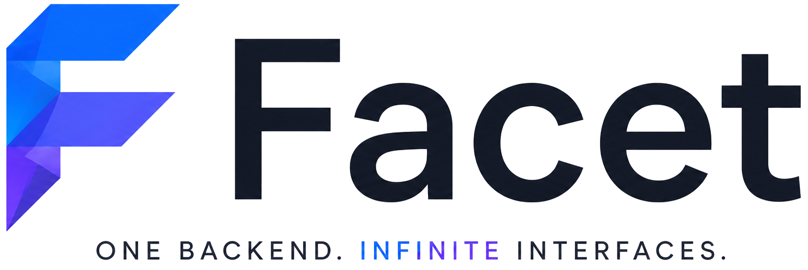

<div align="center">



**One backend. Infinite interfaces.**

_Built for the **c0mpiled** hackathon at Ritsumeikan University._

</div>

---

## What is Facet?

Facet is a prototype for a new layer between an application's **backend** and its **users**.

Today, every backend ships with exactly one frontend — the one its developers decided to build. Everyone who uses that product is forced into the same interface, whether or not it matches how they actually think about their work.

Facet flips that around:

1. **Developers register their API once.** Through the developer dashboard, a developer describes their application — its abstract and each endpoint (method, path, description, and the request/response fields it deals in). No SDKs, no code changes to their backend.
2. **Users describe the interface they want.** In the marketplace, a user picks an application and writes, in plain language, how they'd like to work with it — _"a kanban board grouped by status,"_ _"a calendar of due dates,"_ _"a minimal list focused on today."_
3. **Facet generates the frontend.** A Facet agent reads the application's metadata and produces a working, tailored interface that talks to the real API — end to end.

The result: **one backend can present infinitely many interfaces**, each shaped to a specific user's mental model, without the backend team building or maintaining any of them.

This repository is an early prototype demonstrating that concept — the marketplace, the developer dashboard, and the AI-driven interface generation loop.

> **Note:** This is a hackathon prototype. Authentication is stubbed out (the app pretends you are always logged in), data is stored in a local JSON file, and generated interfaces are illustrative.

---

## How it works (architecture)

```
┌────────────┐        ┌─────────────────┐        ┌──────────────┐
│  Client    │  HTTP  │   Facet Server  │  API   │   OpenAI     │
│  (React)   │ ─────▶ │   (Express)     │ ─────▶ │  generation  │
│            │        │                 │        └──────────────┘
│ Marketplace│        │ • App registry  │
│ Dashboard  │ ◀───── │ • API keys      │
└────────────┘  JSON  │ • Build/generate│
                      │ • db.json store │
                      └─────────────────┘
```

- **`client/`** — React 18 + Vite + TypeScript single-page app (React Router, Framer Motion). Contains the landing page, the marketplace, and the developer dashboard.
- **`server/`** — Express + TypeScript API. Stores registered applications, API keys, and subscription tiers in a local `server/data/db.json` file, and calls the OpenAI API to generate interfaces from an application's metadata plus a user's prompt.

The AI only ever sees an application's **name, abstract, and endpoint definitions** — never anything else.

---

## Running it locally

### Prerequisites

- **Node.js 18+** and **npm**
- An **OpenAI API key** (for the interface-generation feature)

### 1. Configure the server environment

Create `server/.env` (you can copy `server/.env.example`):

```bash
OPENAI_API_KEY=sk-...your-key...
PORT=4000
```

### 2. Install dependencies (client + server)

From the repository root:

```bash
npm run install:all
```

### 3. Start both the server and the client

```bash
npm run dev
```

This runs both processes together:

| Process | URL                     | Notes                              |
| ------- | ----------------------- | ---------------------------------- |
| Client  | http://localhost:5173   | **Open this in your browser**      |
| Server  | http://localhost:4000   | API; the client proxies `/api` → 4000 |

Both sides hot-reload on save (Vite HMR for the client, `tsx watch` for the server). Changes to `server/.env` require a restart.

### Running them separately (optional)

```bash
npm run dev --prefix server   # terminal 1 — API on :4000
npm run dev --prefix client   # terminal 2 — app on :5173
```

### Type-checking

```bash
npm run typecheck             # checks both client and server
```

---

## Project layout

```
Facet/
├── client/                 # React + Vite frontend
│   ├── public/             # logos + favicons (served at site root)
│   └── src/
│       ├── pages/          # landing, marketplace, dashboard, auth
│       ├── components/     # TopNav, icons, animations, etc.
│       └── styles/         # theme.css (design system)
├── server/                 # Express + TypeScript API
│   ├── src/                # routes, services (OpenAI), types
│   └── data/db.json        # file-based data store
├── design.pdf              # original design document
└── package.json            # root scripts (dev / install:all / typecheck)
```

---

## Credits

Created for the **c0mpiled** hackathon at **Ritsumeikan University**. 💜
